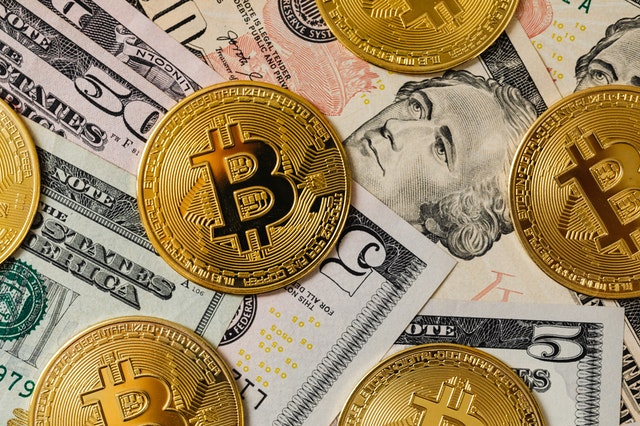

## Table of Contents
- [News](#news)
- [Bitcoin Models](#Bitcoin%20Models)
- [Staking](#staking)
- [Lending](#lending)
- [Dapps](#dapps)
- [Gas Fees](#gas%20fees)
- [Other](#other)

## News
| Website| Description |
| -------| --------- |
| [CRYPTO PANIC](https://cryptopanic.com/)| Aggregated news of crypto  |
| [CRYPTOAST](https://cryptoast.fr/actu/) | FR - Crypto news in French |

    <b><a href="#table-of-contents">↥ Back To Top</a></b>

## Bitcoin models
| Website| Description |
| -------| --------- |
| [Digitalik](https://digitalik.net/btc/)| Stock to flow model |
| [Woobull Charts](https://charts.woobull.com/bitcoin-price-models/)| Bitcoin price models |
| [look into bitcoin](https://www.lookintobitcoin.com/charts/)| Market cycle charts |

    <b><a href="#table-of-contents">↥ Back To Top</a></b>

## Market
| Website| Description |
| -------| --------- |
| [Coingecko](https://www.coingecko.com/) | Market info aggregator |
| [Fear & Greed Index](https://alternative.me/crypto/fear-and-greed-index/) | Crypto market sentiment |
| [Bitcoin google trend](https://trends.google.com/trends/explore?date=all&q=bitcoin) | Google trend for bitcoin |
| [COIN360](https://coin360.com/)| Market heatmap |
| [Bitcoin doubling time](https://casebitcoin.com/charts#doubling_time) | Bitcoin doubling time graph |
| [CoinFairValue](https://www.coinfairvalue.com/) | Coin fair value|

    <b><a href="#table-of-contents">↥ Back To Top</a></b>

## Staking
| Website| Description |
| -------| --------- |
| [Staking Rewards](https://www.stakingrewards.com/)| Earn passive income with crypto |

    <b><a href="#table-of-contents">↥ Back To Top</a></b>

## Lending
| Website| Description |
| -------| --------- |
| [LoanScan](https://loanscan.io/)| Provide the current rates |
| [DEFI PULSE](https://defipulse.com/defi-lending)| ETH - DeFi Lending from DEFI PULSE |
| [DeFi Rate](https://defirate.com/lend/)| Crypto Lending Interest |

    <b><a href="#table-of-contents">↥ Back To Top</a></b>

## DApps
| Website| Description |
| -------| --------- |
| [DappRadar](https://dappradar.com/rankings)| Top blockchain dapps |

    <b><a href="#table-of-contents">↥ Back To Top</a></b>

## Gas fees
| Website| Description |
| -------| --------- |
| [GAS NOW](https://www.gasnow.org/)| ETH Gas Price forecast system |
| [Ethereum Gas Tracker](https://ethgasstation.info/)| Recommended gas prices in gwei |
| [Crypto Fees](https://cryptofees.info/)| Which crypto project are people actually paying to use |
| [TxStreet.com](https://txstreet.com/)| Blockchain live transaction visualizer |
| [Ethereum Gas Tracker](https://txstreet.com/)| Ethereum gas tracker from Etherscan |

    <b><a href="#table-of-contents">↥ Back To Top</a></b>

## Other
| Website| Description |
| -------| --------- |
| [Bitcoin Treasuries](https://bitcointreasuries.org/)| Bitcoin treasuries |

    <b><a href="#table-of-contents">↥ Back To Top</a></b>

